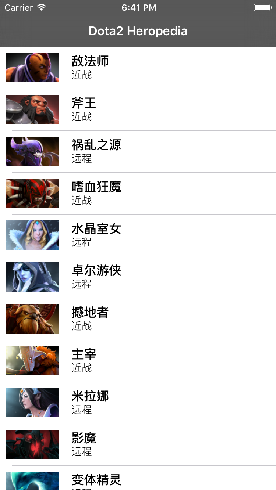

此项目是根据 bilibili 上 [乱童iOS开发入门-做一个Dota2英雄百科客户端](http://space.bilibili.com/9520985/#!/video/0//1) 教程所做，自己只是重复了一下工作。

但是上课的老师讲解非常简单易懂，推荐OC已经入门但还没有项目练习的同学去围观。
关于项目中使用的相关api地址，有部分在代码中，有部分这个 [->wiki](https://wiki.teamfortress.com/wiki/User:RJackson/Dota2API) 里面

